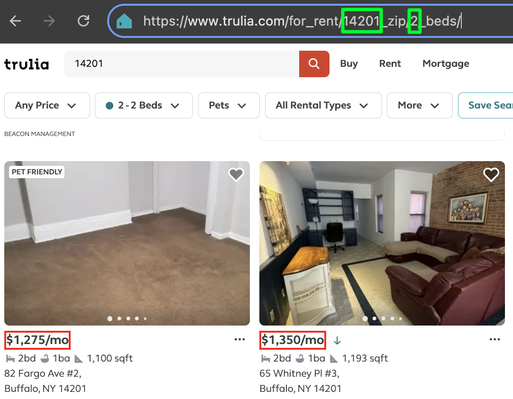

```{r setup, include=FALSE}
knitr::opts_chunk$set(echo = FALSE)

library(tidyverse)
library(jsonlite)
library(tibble)
library(httr)
library(httr2)
library(stringr)
library(rvest)
library(textutils)
library(formattable)

source("credentials.R")

# constants
target_cities <- c('Atlanta-Sandy Springs-Roswell','Buffalo-Cheektowaga-Niagara Falls','San Diego-Carlsbad')
max_bedrooms <- 3


```

## Project Overview

#### __Goal of the Project__

Analyze if market rate apartment rents are consistent with federal defined [Fair Market Rents (FMR)](https://www.huduser.gov/periodicals/ushmc/winter98/summary-2.html) levels in three distinct metropolitan areas.

#### __What is FMR?__

-   FMR is the 40th percentile of gross rents for typical rental units paid by tenants that moved within the last 20 months.
-   FMR provides an estimate for rents for the fiscal year starting Oct 2024-Sept 2025
-   FMR is used to establish benefits such as the Housing Choice Vouchers used to help unhoused individuals find permanent housing.

## Project Overview (cont.)

#### __Potential Problem__
FMR is an annually-released estimate that data does not capture the real-time economic realities that drive local housing markets.

#### __Implications of Problem__
Some individuals that are approved for housing assistance benefits are unable to find an apartment locally that they can pay for with their approved voucher amount based on their area's FMR. In other words, market rates tend to outpace FMR estimates when market conditions quickly drive rental prices up in certain areas.

## About the Data

#### __Data sources__

-   FMR data pulled from HUD using their publicly available [API](https://www.huduser.gov/portal/dataset/fmr-api.html).
-   Market rate data was scraped from the rental listing site [Trulia](http://trulia.com)

#### __Narrowing our Data__

-   Atlanta (GA), Buffalo (NY) and San Diego (CA) Metropolitan Areas
-   Apartments less than 3 bedrooms


## Working with the HUD API

https://www.huduser.gov/portal/dataset/fmr-api.html

```{r custom-api-func, echo=TRUE}

# Custom function to call HUD FMR & IL API
call_hud <- function(endpoint) {
  
  # init request
  req <- request("https://www.huduser.gov") |>   #domain
    req_headers("Accept" = "application/json") |> 
    req_auth_bearer_token(token) |>
    req_url_path(paste("hudapi/public/fmr/", endpoint,sep="")) |> #path
    req_user_agent("Mozilla/5.0 (Windows NT 10.0; Win64; x64) AppleWebKit/537.36 (KHTML, like Gecko) Chrome/64.0.3282.140 Safari/537.36 Edge/18.17763")
  
  # parse response
  json_resp <- req_perform(req) |> 
    resp_body_string() |>
    fromJSON() 
  
  # return parsed response
  return(json_resp) 
}
```

## API Responses
__Getting the Ids for the Metropolitan Areas__

```{r get-metro-area-ids_single, echo=TRUE}
metro_areas <- call_hud("listMetroAreas")
```

```{r get-metro-area-ids}

  # A4: cleanup and filter list of metro areas 
  #     for target areas
  metro_areas <- as.data.frame(metro_areas) |>
    # split area_name col into city and type
    separate_wider_regex(
      area_name, c(area_name= ".*", ",\\s", type=".*")
    ) |>
    # split type col into state and type
    mutate(
      state = substring(type,1,2),
    ) |>
    # filter by our target areas
    filter(area_name %in% target_cities) |>
    select(c('cbsa_code',  'area_name', 'state')) 

glimpse(metro_areas)  
```

__Getting the FMR Data by Zip Code for our Target Metropolitan Areas__

```{r call-hud-zip}
# A5: Call, clean-up and merge metro area data
# Custom function to call and clean up metro area data
get_metro_data <- function(row) {
  # use "cbsa_code" col as entity_id for API call
  entity_resp <- call_hud(paste("data", row$cbsa_code, sep="/"))
  
  # clean up data
  df <- as_tibble(entity_resp$data$basicdata) |>
    rename_all(~tolower(str_trim(str_replace_all(., "-", "_")))) |>
    rename(studio = efficiency) |>
    mutate( 
      area_name = row$area_name
    ) |>
    relocate(area_name, .before=zip_code) 
}

# init df with first row
metro_fmrs <- tibble()
```
```{r call-hud-zip-2, echo=TRUE}
for (i in 1:nrow(metro_areas)) {
  metro_fmrs <- rbind(metro_fmrs, get_metro_data(metro_areas[i,]))
}
```
```{r call-hud-zip-3}
metro_fmrs <- metro_fmrs |>
  filter(zip_code != 'MSA level') |>
  select(-c('three_bedroom','four_bedroom'))
  
head(metro_fmrs)

zip_codes <- metro_fmrs |>
  select(c("area_name", "zip_code"))
```

## Tidying the FMR Data

```{r tidy-fmr-data, echo=TRUE}
metro_fmr_by_zip_and_num_bds <- metro_fmrs |>
  pivot_longer(
    cols = studio:two_bedroom,
    names_to = c("bedrooms"),
    values_to = "fmr"
  ) |>
  mutate(
    bedrooms = case_when(
      bedrooms == 'studio' ~ as.integer(0),
      bedrooms == 'one_bedroom' ~ as.integer(1),
      bedrooms == 'two_bedroom' ~ as.integer(2)
    )
  ) 
```

```{r tidy-fmr-data-2, echo=FALSE}
metro_fmr_msa_by_num_bds <- metro_fmr_by_zip_and_num_bds |>
  arrange(zip_code) |>
  filter(bedrooms < max_bedrooms) |>
  filter(zip_code == 'MSA level')

head(metro_fmr_by_zip_and_num_bds)

```

## Scraping Trulia
```{r get-trulia, echo=TRUE}
  page_reponse <- read_html(paste("https://www.trulia.com/for_rent/", 14201, "_zip/", 2, "_beds/", sep=""))
```
<div>
{#id .class width=49% height=49% float=left}
{#id .class width=50% height=50%}
</div>

## Scraping Trulia (Cont.)

```{r init-scraper}

# B1: Declare parser constants

# init market rate tibble
real_estate_df <- tibble(
  zip_code = character(),
  bedrooms = integer(),
  market_rate = integer()
)

# update user agents
user_agent <- "Mozilla/5.0 (Windows NT 10.0; Win64; x64) AppleWebKit/537.36 (KHTML, like Gecko) Chrome/64.0.3282.140 Safari/537.36 Edge/18.17763"
set_config(add_headers(`User-Agent` = user_agent))

delay <- 10       # number of seconds to delay each GET request

# custom function for delayed scraping
throttled_GET <- slowly(
  ~read_html(.),
  rate = rate_delay(delay)
)

# custom function to remove misc chars
cleanup_price <- function(s) {
  t <- str_replace_all(s, "([$,])", "") #remove dollar signs and commas
  x <- gsub("^([0-9]+).*", "\\1", t) #only return first group of integers
  return(as.integer(x))
} 

# B2: Scrape Real Estate Data

# can be altered for multipage scraping
current_page <- 1 # page counter
start <- 1        # start index 
end <- 1          # end index. Use #nrow(zip_codes) to use zip_code length 
beds <-2

  
  for (i in start:end) {
    # get zip code at current index
    zip <- zip_codes[i,]$zip_code
    
    # B3: build path based on the current zip, beds and page vars
    # and send to our throttled GET request function 
    page_reponse <- throttled_GET(paste("https://www.trulia.com/for_rent/", zip, "_zip/", beds, "_beds/", current_page, "_p/", sep=""))
    
    # find price from current page html
    result_container <- page_reponse %>% 
      html_element(xpath='//ul[@data-testid="search-result-list-container"]' )
    
    # B4: save our rental prices to Trulia
    listings <- result_container %>% 
      html_elements(xpath = '//li//div[@data-testid="property-price"]' ) %>% 
      html_text()  

    # B5: loop through all listing prices 
    # and append to market rate tibble
    for (s in listings)
      real_estate_df <- real_estate_df |>
        add_row(zip_code = zip, bedrooms = beds, market_rate = cleanup_price(s))
  }


head(real_estate_df, n=10)
```

## Calculating th 40th Percentile for Market Rates

```{r read-parsed-data}

# C1: Read previously parsed file from Trulia
# add mean for market rate data based on zipcode and # of bedrooms
# then add metro ids 
market_rates <- read_csv(
    file = "trulia_data.csv", 
    col_names = TRUE, 
    col_types = cols(.default = col_character(), market_rate = "i", bedrooms = "i"),
    show_col_types = FALSE
  ) |>
  filter(
    bedrooms < 3 &
    market_rate < 10000 # remove outliers
  ) 
```
```{r group-and-summarise, echo=TRUE, warning = FALSE}
# group by zip codes and # bedrooms
market_rate_by_zip_and_num_bds <- market_rates |>
  group_by(across(all_of(c("zip_code", "bedrooms")))) |>
  summarise(
    market_rate = round(quantile(market_rate,probs=0.4))
  )

head(market_rate_by_zip_and_num_bds)
```
## Joining dataframes

```{r combine-dfs, echo=TRUE}
# Combine FMR and Market Rate Dataframes By Zip Code
combined_df_by_zip <- metro_fmr_by_zip_and_num_bds |>
  right_join(market_rate_by_zip_and_num_bds, by= c('zip_code'='zip_code', 'bedrooms'='bedrooms')) |>
  mutate(bedrooms = as.factor(bedrooms))

# C4: pivot longer by estimate type
combined_df_by_zip_and_type <- combined_df_by_zip |>
  pivot_longer(
    cols = c(fmr, market_rate),
    names_to = c("type"),
    values_to = "rent"
  )

```
```{r cleaning-up-df}
combined_df_by_zip_and_type <- combined_df_by_zip_and_type |>
  mutate(
    type = str_replace_all(type, "_", " ")
  )

head(combined_df_by_zip_and_type)
```

## Plotting the Distribution of Estimate Types

```{r histo-diffs, fig.width=10, fig.height=5, warning=FALSE, message=FALSE}

mean_rents <- combined_df_by_zip_and_type |>
  group_by(type, area_name, bedrooms) |> 
  summarise(mean_rent= mean(rent)
)

# distribution of fmr vs market reate
ggplot(combined_df_by_zip_and_type, aes(rent, fill=fct_rev(type), color=fct_rev(type))) +
  geom_density(alpha = .3) +
  geom_vline(data=mean_rents, aes(xintercept=mean_rent, col=type), linetype = "twodash") +
  theme( 
    plot.title = element_text(hjust = 0.5),
    plot.subtitle = element_text(hjust = 0.5)
  ) + 
  labs(
    title = "Density of Average Rents by Estimate Type",
    subtitle = "Faceted by Area and Apt. Size (# of Bedrooms)",
    x = "Average Rent",
    y = "Density"
  ) +
  scale_x_continuous(labels = scales::dollar_format()) + 
  scale_fill_discrete(
    name = element_blank(), 
    labels=c('Market Rate', 'FMR'),
    guide = guide_legend(reverse = TRUE) 
  ) +
  scale_color_discrete(
    name = element_blank(), 
    labels=c('Market Rate', 'FMR'),
    guide = guide_legend(reverse = TRUE) 
  ) + 
  facet_grid(vars(bedrooms), vars(area_name))

```

## Count of Zip Codes for Each Estimate Type

```{r calc-rent-diffs, fig.width=10, fig.height=4, message=FALSE, warning=FALSE}

# Calculate Rent Differences by Zip
# create df with the margin of error 
combined_df_by_zip_diffs <- combined_df_by_zip |>
  mutate(
    margin_of_error = market_rate - fmr,
    at_or_below_fmr = as.factor(fmr >= market_rate)
  ) |>
  select(-c(market_rate))

# Counts by Estimate Type
counts_by_estimate_type <- combined_df_by_zip_diffs |>
  group_by(area_name, bedrooms, at_or_below_fmr) |>
  summarise(
    count_type =  n(),
  ) |>
  ungroup() |>
  arrange(area_name, bedrooms, desc(at_or_below_fmr))

# calc total counts
combined_df_by_zip_diffs_total_counts <- combined_df_by_zip_diffs |>
  group_by(area_name, bedrooms) |>
  summarise(
    count_total = n(),
  ) |>
  ungroup() 

# calculate percent of type per group
counts_by_estimate_type <- counts_by_estimate_type |>
  left_join(combined_df_by_zip_diffs_total_counts, by=c("area_name", "bedrooms")) |>
  mutate(
    type_ratio = count_type / count_total
  ) 

ggplot(combined_df_by_zip_diffs, aes(y=fct_rev(bedrooms), fill=at_or_below_fmr)) +
  geom_bar(position = position_dodge()) +
  #geom_text(stat='count', aes(label = after_stat(count)), hjust=-.3, position = position_dodge(width=0.9),  size=3) +
  geom_text(data=counts_by_estimate_type, mapping = aes(label = paste(count_type, " (", round(type_ratio * 100, 1), "%)", sep=""), x = count_type), stat="identity", hjust=-.1, position = position_dodge(width=0.9),  size=2.5) + 
  theme(
    legend.position = "top", 
    plot.title = element_text(hjust = 0.5)
  ) +
  labs(
    title = "Count of Zipcodes by Estimate Type and Apartment Size",
    x = "# of Apartments",
    y = "Apartment Type (in # of bedrooms)"
  ) + 
  scale_x_continuous(expand = c(0, 55)) +
  scale_fill_discrete(
    name = element_blank(), 
    labels=c('Above FMR', 'At or below FMR'),
    guide = guide_legend(reverse = TRUE) 
  ) +
  facet_wrap(~area_name, ncol=3)
#  facet_grid(vars(bedrooms), vars(area_name))
  
```

## Absolute Dollar Difference

```{r dollar-diff, fig.width=10, fig.height=5}
ggplot(combined_df_by_zip_diffs, aes(abs(margin_of_error), fct_rev(bedrooms), fill=at_or_below_fmr)) +
  geom_boxplot(color="#666666") +
  theme(
    legend.position="top", 
    plot.title = element_text(hjust = 0.5)
  ) +
  labs(
    title = "Distribution of Absolute Dollar Difference Between Market Rate and FMR Estimates",
    x = "Dollar Difference between Market Rate and FMR",
    y = "Size of Apt. (# of Bedrooms)"
  ) +
  scale_x_continuous(labels = scales::dollar_format()) + 
  scale_fill_discrete(
    name = element_blank(), 
    labels=c('Above FMR', 'At or below FMR'),
    guide = guide_legend(reverse = TRUE) 
  ) +
  facet_wrap(~area_name, ncol=3, shrink=FALSE) 
  # facet_grid(vars(bedrooms), vars(area_name)) 
```


## What is the Median Rent Difference Above FMR? 

```{r median-difference, echo=FALSE, message=FALSE, warning=FALSE}

# C8: Cost Difference

median_diffs <- combined_df_by_zip_diffs |>
  group_by(area_name, bedrooms, at_or_below_fmr) |>
  summarise(
    median_difference = median(margin_of_error)
  ) |>
  ungroup() |>
  mutate(at_or_below_fmr = ifelse(at_or_below_fmr == TRUE, "Median $Diff Below FMR", "Median $Diff Above FMR")) |>
  pivot_wider(
    names_from = at_or_below_fmr,
    values_from = median_difference
  ) 

median_fmr <- combined_df_by_zip_diffs |>
  group_by(area_name, bedrooms) |>
  summarise(
    median_fmr = median(fmr)
  ) |>
  ungroup()


median_diffs_df_clean <- median_diffs |>
  left_join(median_fmr, by=c("area_name", "bedrooms")) |>
  rename(FMR = median_fmr) |>
  rename(Area = area_name) |>
  rename(Bedrooms = bedrooms) |>
  relocate(FMR, .before=`Median $Diff Above FMR`) |>
  relocate(`Median $Diff Below FMR`, .before=`Median $Diff Above FMR`) |> 
  mutate(
    `FMR` = paste("$", abs(round(`FMR`,0)), sep=""),
    `Median $Diff Below FMR` = paste("$", abs(round(`Median $Diff Below FMR`,0)), sep=""),
    `Median $Diff Above FMR` = paste("$", abs(round(`Median $Diff Above FMR`,0)), sep="")
  ) 


groups_of_interest_above_fmr <- median_diffs_df_clean |>
  filter((Area == 'Buffalo-Cheektowaga-Niagara Falls' & Bedrooms == 1) | (Area == 'Buffalo-Cheektowaga-Niagara Falls' & Bedrooms == 2) ) |>
  select(-c(`Median $Diff Below FMR`))

print("Groups of Interest where Mark Rate Exceeded FMR")
formattable(groups_of_interest_above_fmr, 
            align=c("l","c","c","c","c"),
            list(
              Area = formatter("span", style = x ~ style(color = "gray")),
              `Median $Diff Above FMR`= formatter("span", style = ~ style(color = "red"))
            )                     
          )


groups_of_interest_below_fmr <- median_diffs_df_clean |>
  filter((Area == 'San Diego-Carlsbad' & Bedrooms == 2))

print("Groups of Interest where FMR Exceeded Market Rates")
formattable(groups_of_interest_below_fmr, 
            align=c("l","c","c","c","c"),
            list(
              Area = formatter("span", style = x ~ style(color = "gray")),
              `Median $Diff Below FMR`= formatter("span", style = ~ style(color = "green")),
              `Median $Diff Above FMR`= formatter("span", style = ~ style(color = "red"))
            )                     
          )

```


## Conclusion & Limitations

* Analysis is based on a "snapshot" of parsed data on December 12th showing only a sample of current listings. 
* Some zip codes had no rental listings available on that particular day. 
* AJAX pagination issues
* Should collect real estate data over time to better represent real market conditions. Alt. use time-series data like the Zillow Observed Rent Index (ZORI).
* Future work: Expand to include 3/4 bedroom apartments and other metropolitan areas

